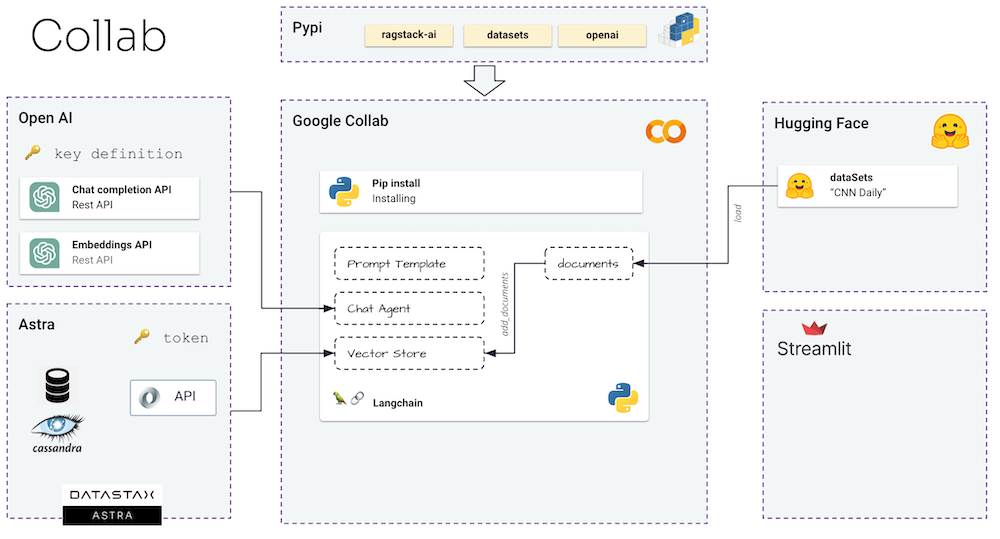
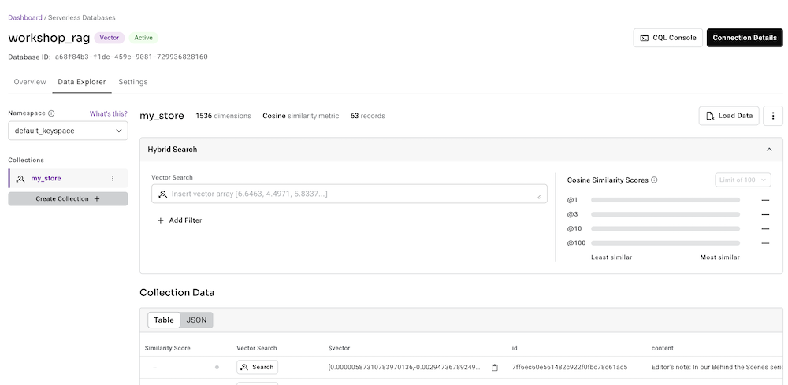
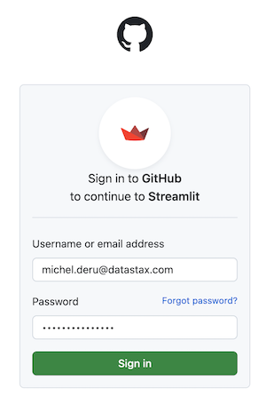
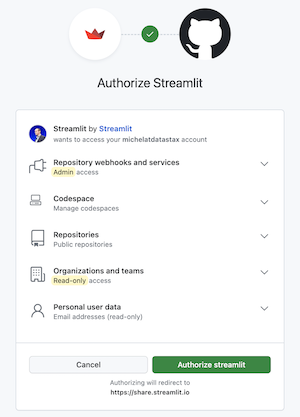
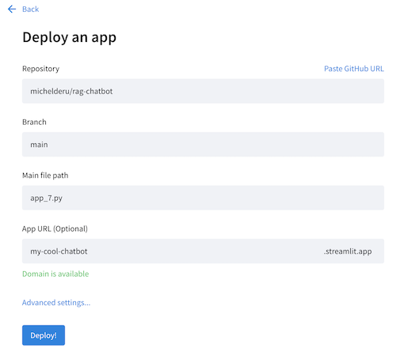

# Build your own RAG Chatbot
Welcome to this workshop to build and deploy your own Chatbot using Retrieval Augmented Generation with Astra DB and the OpenAI Chat Model.

It leverages [DataStax RAGStack](https://docs.datastax.com/en/ragstack/docs/index.html), which is a curated stack of the best open-source software for easing implementation of the RAG pattern in production-ready applications that use Astra Vector DB or Apache Cassandra as a vector store.


What you'll learn:
-  How to leverage [DataStax RAGStack](https://docs.datastax.com/en/ragstack/docs/index.html) for production-ready use of the following components:
    -  The [Astra DB Vector Store](https://db.new) for Semantic Similarity search
    -  [LangChain](https://www.langchain.com) for linking OpenAI and Astra DB
-  How to use [OpenAI's Large Language Models](https://platform.openai.com/docs/models) for Q&A style chatbots
-  How to use [Streamlit](https://streamlit.io) to easily deploy your awesome app to the internet for everyone to see!

- Slides of the presentation can be found [HERE](assets/meetups-slides.pdf)


## 1️⃣ Prerequisites
This workshop assumes you have access to:
1. [A Github account](https://github.com)
2. [Google Colab](https://colab.research.google.com/)

During the course, you'll gain access to the following by signing up for free:
1. [DataStax Astra DB](https://astra.datastax.com) (you can sign up through your Github account)
2. [OpenAI account](https://platform.openai.com/signup) (you can sign up through your Github account)
3. [Streamlit](https://streamlit.io) to deploy your amazing app (you can sign up through your Github account)

Follow the below steps and provide the **Astra DB API Endpoint**, **Astra DB ApplicationToken** and **OpenAI API Key** when required.

### Sign up for Astra DB
Make sure you have a vector-capable Astra database (get one for free at [astra.datastax.com](https://astra.datastax.com))
- You will be asked to provide the **API Endpoint** which can be found in the right pane underneath *Database details*.
- Ensure you have an **Application Token** for your database which can be created in the right pane underneath *Database details*.


### Sign up for OpenAI
- Create an [OpenAI account](https://platform.openai.com/signup) or [sign in](https://platform.openai.com/login).
- Navigate to the [API key page](https://platform.openai.com/account/api-keys) and create a new **Secret Key**, optionally naming the key.


### Sign up for Streamlit
Follow the steps outlined [here](https://docs.streamlit.io/streamlit-community-cloud/get-started/quickstart).


## 2️⃣ First try the concepts in a Colab Notebook
To kick this workshop off, we'll first try the concepts in a [Colab Notebook](https://colab.research.google.com/drive/1_n-QZyuP898JNaX7RDnCmw9lkibgEuP-).

This notebook shows the steps to take to use the Astra DB Vector Store as a means to make LLM interactions meaningfull and without hallucinations. The approach taken here is Retrieval Augmented Generation.

You'll learn:

1. About the content in a CNN dataset (we'll use the news article about Daniel Radcliffe in this example)
2. How to interact with the OpenAI Chat Model without providing this context
3. How to load this context into Astra DB Vector Store
4. How to run a semantic similarity search on Astra DB Vector Store
5. How to use this context with the OpenAI Chat Model

[](https://colab.research.google.com/drive/1_n-QZyuP898JNaX7RDnCmw9lkibgEuP-#scrollTo=RUbC-NIgkSR9)



## 3️⃣ Open this tutorial on Github Codespaces
To make life easier, we'll use the awesome Github Codespace functionality. Github offers you a completely integrated developer experience and resources to get started quickly. How?

1. Open the [build-your-own-rag-agent](https://github.com/michelderu/build-your-own-rag-agent) repository
2. Click on `Use this template`->`Ceate new repository` as follows:

    

3. Now select your github account and name the new repository. Ideally also set the description. Click `Create repository`

    

4. Cool! You just created a copy in your own Gihub account! Now let's get started with coding. Click `Create codespace on main` as follows:

    

And you're ready to rock and roll! 🥳  
As Codespaces creates your dev environment based on `Python 3.11`, it will automatically install the Python dependecies from `requirements.txt`. So, no need to `pip install` anything here. It will also set up prt forwarding so you can access subsequent Streamlit apps from anywhere.  
When the codespace start up, it will run a Streamlit Hello World app for you which shows some of the awesome capabilities of this UI framework. When you're done playing, just click `ctrl-c` in the `terminal` to stop running it.

## 4️⃣ Getting started with Streamlit to build an app

Let us now build a real application we will use the following architecture


In this workshop we'll use Streamlit which is an amazingly simple to use framework to create front-end web applications.

To get started, let's create a *hello world* application as follows:

```python
import streamlit as st

# Draw a title and some markdown
st.title("Your personal Efficiency Booster")
st.markdown("""Generative AI is considered to bring the next Industrial Revolution.  
Why? Studies show a **37% efficiency boost** in day to day work activities!""")
```
The first step is to import the streamlit package. Then we call `st.title` to write a title to the web page and lastly we write some markdown content to the web page using `st.markdown`.

To get this application started locally you'll need to install the streamlit dependency as follows (not needed in Codespaces):
```bash
pip install streamlit
```

Now run the app:
```bash
streamlit run app_1.py
```

This will start the application server and will bring you to the web page you just created.

Simple, isn't it? 🤩

## 5️⃣ Add a Chatbot interface to the app

In this step we'll start preparing the app to allow for chatbot interaction with a user. We'll use the following Streamlit components:
1. 
2. `st.chat_input` in order for a user to allow to enter a question
2. `st.chat_message('human')` to draw the user's input
3. `st.chat_message('assistant')` to draw the chatbot's response

This results in the following code:

```python
# Draw the chat input box
if question := st.chat_input("What's up?"):
    
    # Draw the user's question
    with st.chat_message('human'):
        st.markdown(question)

    # Generate the answer
    answer = f"""You asked: {question}"""

    # Draw the bot's answer
    with st.chat_message('assistant'):
        st.markdown(answer)
```

Try it out using [app_2.py](./app_2.py) and kick it off as follows.  
If your previous app is still running, just kill it by pressing `ctrl-c` on beforehand.

```bash
streamlit run app_2.py
```

Now type a question, and type another one again. You'll see that only the last question is kept.

Why???

This is because Streamlit will redraw the whole screen again and again based on the latest input. As we're not remembering the questions, only the last on is show.

## 6️⃣ Remember the chatbot interaction

In this step we'll make sure to keep track of the questions and answers so that with every redraw the history is shown.

To do this we'll take the next steps:
1. Add the question in a `st.session_state` called `messages`
2. Add the answer in a `st.session_state` called `messages`
3. When the app redraws, print out the history using a loop like `for message in st.session_state.messages`

This approach works because the `session_state` is stateful across Streamlit runs.

Check out the complete code in [app_3.py](./app_3.py). 

As you'll see we use a dictionary to store both the `role` (which can be either the Human or the AI) and the `question` or `answer`. Keeping track of the role is important as it will draw the right picture in the browser.

Run it with:
```bash
streamlit run app_3.py
```

Now add multiple questions and you'll see these are redraw to the screen every time Streamlit reruns. 👍

## 7️⃣ Now for the cool part! Let's integrate with the OpenAI Chat Model 🤖

Here we'll link back to the work we did using the Colab Notebook and integrate the question with a call to the OpenAI Chat Model.

Remember that Streamlit reruns the code everytime a user interacts? Because of this we'll make use of data and resource caching in Streamlit so that a connection is only set-up once. We'll use `@st.cache_data()` and `@st.cache_resource()` to define caching. `cache_data` is typically used for data structures. `cache_resource` is mostly used for resources like databases.

This results in the following code to set up the Prompt and Chat Model:

```python
# Cache prompt for future runs
@st.cache_data()
def load_prompt():
    template = """You're a helpful AI assistent tasked to answer the user's questions.
You're friendly and you answer extensively with multiple sentences. You prefer to use bulletpoints to summarize.

QUESTION:
{question}

YOUR ANSWER:"""
    return ChatPromptTemplate.from_messages([("system", template)])
prompt = load_prompt()

# Cache OpenAI Chat Model for future runs
@st.cache_resource()
def load_chat_model():
    return ChatOpenAI(
        temperature=0.3,
        model='gpt-3.5-turbo',
        streaming=True,
        verbose=True
    )
chat_model = load_chat_model()
```

Instead of the static answer we used in the previous examples, we'll now switch to calling the Chain:

```python
# Generate the answer by calling OpenAI's Chat Model
inputs = RunnableMap({
    'question': lambda x: x['question']
})
chain = inputs | prompt | chat_model
response = chain.invoke({'question': question})
answer = response.content
```
Check out the complete code in [app_4.py](./app_4.py).

Before we continue, we have to provide the `OPENAI_API_KEY` in `./streamlit/secrets.toml`. There is an example provided in `secrets.toml.example`:

```toml
# OpenAI secrets
OPENAI_API_KEY = "<YOUR-API-KEY>"
```

To get this application started locally you'll need to install several dependencies as follows (not needed in Codespaces):
```bash
pip install openai tiktoken astrapy langchain langchain_openai langchain-community
```

Now run the app:
```bash
streamlit run app_4.py
```

You can now start your questions-and-answer interaction with the Chatbot. Of course, as there is no integration with the Astra DB Vector Store, there will not be contextualized answers. As there is no streaming built-in yet, please give the agent a bit of time to come up with the complete answer at once.

Let's start with the question:

    What does Daniel Radcliffe get when he turns 18?

As you will see, you'll receive a very generic answer without the information that is available in the CNN data.

## 8️⃣ Combine with the Astra DB Vector Store for additional context

Now things become really interesting! In this step we'll integrate the Astra DB Vector Store in order to provide context in real-time for the Chat Model. Steps taken to implement Retrieval Augmented Generation:
1. User asks a question
2. A semantic similarity search is run on the Astra DB Vector Store
3. The retrieved context is provided to the Prompt for the Chat Model
4. The Chat Model comes back with an answer, taking into account the retrieved context

We will reuse the data we inserted thanks to the notebook.



In order to enable this, we first have to set up a connection to the Astra DB Vector Store:

```python
# Cache the Astra DB Vector Store for future runs
@st.cache_resource(show_spinner='Connecting to Astra')
def load_retriever():
    # Connect to the Vector Store
    vector_store = AstraDB(
        embedding=OpenAIEmbeddings(),
        collection_name="my_store",
        api_endpoint=st.secrets['ASTRA_API_ENDPOINT'],
        token=st.secrets['ASTRA_TOKEN']
    )

    # Get the retriever for the Chat Model
    retriever = vector_store.as_retriever(
        search_kwargs={"k": 5}
    )
    return retriever
retriever = load_retriever()
```

The only other thing we need to do is alter the Chain to include a call to the Vector Store:

```python
# Generate the answer by calling OpenAI's Chat Model
inputs = RunnableMap({
    'context': lambda x: retriever.get_relevant_documents(x['question']),
    'question': lambda x: x['question']
})
```

Check out the complete code in [app_5.py](./app_5.py).

Before we continue, we have to provide the `ASTRA_API_ENDPOINT` and `ASTRA_TOKEN` in `./streamlit/secrets.toml`. There is an example provided in `secrets.toml.example`:

```toml
# Astra DB secrets
ASTRA_API_ENDPOINT = "<YOUR-API-ENDPOINT>"
ASTRA_TOKEN = "<YOUR-TOKEN>"
```

And run the app:
```bash
streamlit run app_5.py
```

Let's again ask the question:

    What does Daniel Radcliffe get when he turns 18?

As you will see, now you'll receive a very contextual answer as the Vector Store provides relevant CNN data to the Chat Model.

## 9️⃣ Finally, let's make this a streaming app

How cool would it be to see the answer appear on the screen as it is generated! Well, that's easy.

First of all, we'll create a Streaming Call Back Handler that is called on every new token generation as follows:

```python
# Streaming call back handler for responses
class StreamHandler(BaseCallbackHandler):
    def __init__(self, container, initial_text=""):
        self.container = container
        self.text = initial_text

    def on_llm_new_token(self, token: str, **kwargs):
        self.text += token
        self.container.markdown(self.text + "▌")
```

Then we explain the Chat Model to make user of the StreamHandler:

```python
response = chain.invoke({'question': question}, config={'callbacks': [StreamHandler(response_placeholder)]})
```

The `response_placeholer` in the code above defines the place where the tokens need to be written. We can create that space by callint `st.empty()` as follows:

```python
# UI placeholder to start filling with agent response
with st.chat_message('assistant'):
    response_placeholder = st.empty()
```

Check out the complete code in [app_6.py](./app_6.py).

And run the app:
```bash
streamlit run app_6.py
```

Now you'll see that the response will be written in real-time to the browser window.

## 1️⃣0️⃣ Now let's make magic happen! 🦄

The ultimate goal of course is to add your own company's context to the agent. In order to do this, we'll add an upload box that allows you to upload PDF files which will then be used to provide a meaningfull and contextual response!

First we need an upload form which is simple to create with Streamlit:

```python
# Include the upload form for new data to be Vectorized
with st.sidebar:
    with st.form('upload'):
        uploaded_file = st.file_uploader('Upload a document for additional context', type=['pdf'])
        submitted = st.form_submit_button('Save to Astra DB')
        if submitted:
            vectorize_text(uploaded_file)
```

Now we need a function to load the PDF and ingest it into Astra DB while vectorizing the content.

```python
# Function for Vectorizing uploaded data into Astra DB
def vectorize_text(uploaded_file, vector_store):
    if uploaded_file is not None:
        
        # Write to temporary file
        temp_dir = tempfile.TemporaryDirectory()
        file = uploaded_file
        temp_filepath = os.path.join(temp_dir.name, file.name)
        with open(temp_filepath, 'wb') as f:
            f.write(file.getvalue())

        # Load the PDF
        docs = []
        loader = PyPDFLoader(temp_filepath)
        docs.extend(loader.load())

        # Create the text splitter
        text_splitter = RecursiveCharacterTextSplitter(
            chunk_size = 1500,
            chunk_overlap  = 100
        )

        # Vectorize the PDF and load it into the Astra DB Vector Store
        pages = text_splitter.split_documents(docs)
        vector_store.add_documents(pages)  
        st.info(f"{len(pages)} pages loaded.")
```

Check out the complete code in [app_7.py](./app_7.py).

To get this application started locally you'll need to install the PyPDF dependency as follows (not needed in Codespaces):
```bash
pip install pypdf
```

And run the app:
```bash
streamlit run app_7.py
```

Now upload a PDF document (the more the merrier) that is relevant to you and start asking questions about it. You'll see that the answers will be relevant, meaningful and contextual! 🥳 See the magic happen!


## 1️⃣1️⃣ Let's deploy this cool stuff to Streamlit cloud!
In this step we'll deploy your awesome app to the internet so everyone can enjoy your cool work and be amazed!

### Set up your Streamlit account
If you have not do so before, please set up your account on Streamlit. When you already have an account skip to the next step and deploy the app.

1. Head over to [Streamlit.io](https://streamlit.io) and clikc `Sign up`. Then select `Continue with Github`:

    

2. Log in using your Github credentials:

    

3. Now authorize Streamlit:

    

4. And set up your account:

    

### Deploy your app

On the main screen, when logged in, click `New app`.

1. When this is your first deployment, provide additional permissions:

    

2. Now define your application settings. Use YOUR repository name, and name the Main file path as `app_7.py`. Pick a cool App URL as you'll app will be deployed to that:

    

3. Click on Advanced, select Python 3.11 and copy-paste the contents from your `secrets.toml`.

Click Deploy! Wait for a bit and your app is online for everyone to use!

⛔️ Be aware that this app is public and uses your OpenAI account which will incur cost. You'll want to shield it off by clicking `Settings->Sharing` in the main screen and define the email addresses that are allowed access. In order to enable this, link your Google account.

# Python environments
In case you want to run all of the above locally, it's useful to create a *Virtual Environment*. Use the below to set it up:
```
python3 -m venv myenv
```
Then activate it as follows:
```
source myenv/bin/activate   # on Linux/Mac
myenv\Scripts\activate.bat  # on Windows
```
Now you can start installing packages:
```
pip3 install -r requirements.txt
```
In order to check which packages have been installed:
```
pip3 freeze
```
Which you can save to requirements.txt if you want:
```
pip3 freeze > requirements.txt
```
